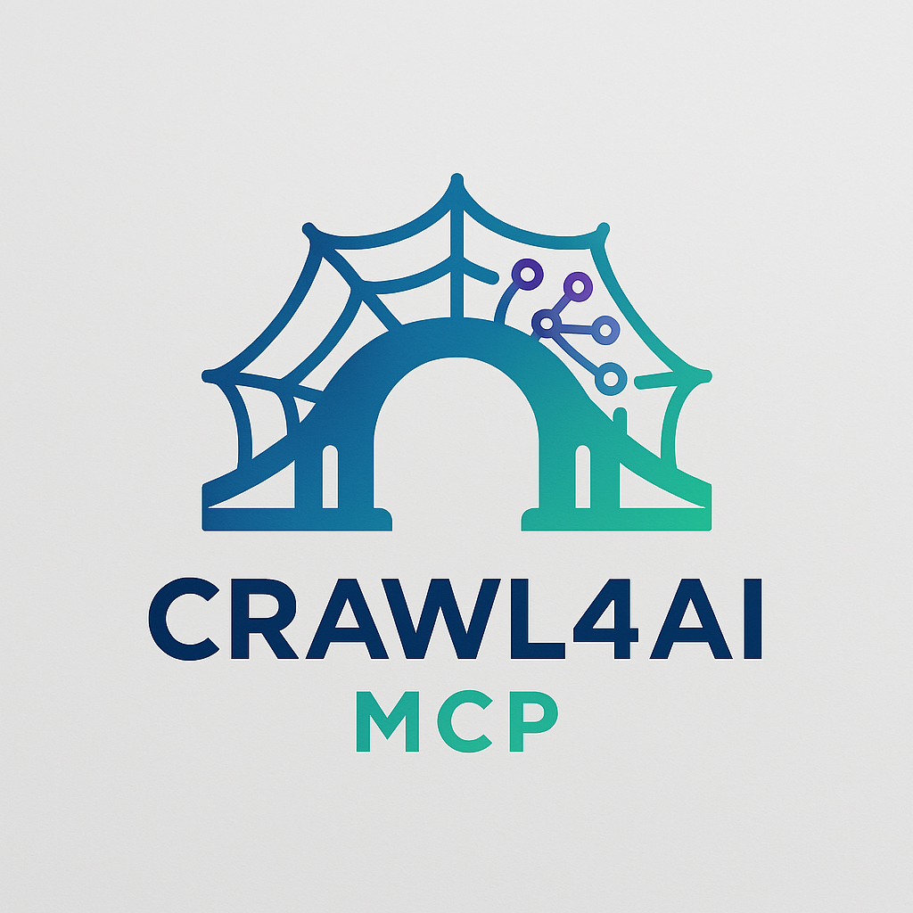

# Contributing to Crawl4AI-MCP

<div align="center">
  
[](https://github.com/wyattowalsh/crawl4ai-mcp)

*Empowering AI models with real-time web access and processing.*

[](https://www.python.org/downloads/)
[](https://opensource.org/licenses/MIT)
[](http://makeapullrequest.com)
[![MCP Compatible](https://img.shields.io/badge/MCP-compatible-green.svg?style=flat-square&logo=data:image/svg+xml;base64,PHN2ZyBmaWxsPSJub25lIiB4bWxucz0iaHR0cDovL3d3dy53My5vcmcvMjAwMC9zdmciIHZpZXdCb3g9IjAgMCAxMjEgMTI4Ij48cGF0aCBkPSJNMzIgNjMuNzY4YzAtMTMuMzA2IDguMjk3LTI0Ljc4MSAxOS44MjMtMjkuNzk4bDMuMDAzLTEuMzE0VjAuNTE5SDM0Ljk2N0MxNS42NjkgMC41MTkgMCAxNi4zMjEgMCAzNS42NjV2NTYuNjcxYzAgMTkuMzQ0IDE1LjY2OSAzNS4xNDYgMzQuOTY3IDM1LjE0Nmg1MS4wNjdjMTkuMyAwIDM0Ljk2Ny0xNS44MDIgMzQuOTY3LTM1LjE0NlY2My43NjhoLTE5Ljg2MnYyOC41NjZjMC4wMDEgOC4zODMtNi43ODYgMTUuMTcgMTUuMTcgMTUuMTdzMTUuMTctNi43ODcgMTUuMTctMTUuMTZWNjMuNzY4SDY4LjUxN3YyOC41NjZjMCA4LjM4My02Ljc4NyAxNS4xNy0xNS4xNyAxNS4xN0MzOS43ODcgMTA3LjUgMzIgOTIuNzE4IDMyIDc4LjMzNFY2My43NjhaIiBmaWxsPSIjNTJFNDIyIi8+PHBhdGggZD0iTTUyLjI1NSYwLjUxOXYzMy4zMzFjMTUuNjIxIDAgMjguNDggMTIuODcgMjguNDggMjguNDhIMTEwLjJDNTEuOCAxNi4zMjEgMzIuNDIxIDAuNTE5IDMyLjQyMSAwLjUxOUg1Mi4yNTVaIiBmaWxsPSIjNTJFNDIyIi8+PHBhdGggZD0iTTUyLjI1NSAzMC4xNzZjLTcuMzUyIDAtMTQuMTc0IDMuMDQ3LTE5LjAyMyA4LjA3Ni05LjY5NyAxMC4wNTgtOS42OTcgMjYuMzY3IDAgMzYuNDI2IDQuODQ5IDUuMDI4IDExLjY3MSA4LjA3NiAxOS4wMjMgOC4wNzZzMTQuMTc0LTMuMDQ4IDE5LjAyMy04LjA3NmM5LjY5Ny0xMC4wNTkgOS42OTctMjYuMzY4IDAtMzYuNDI2LTQuODQ5LTUuMDI5LTExLjY3MS04LjA3Ni0xOS4wMjMtOC4wNzZaIiBmaWxsPSIjNDdCNDdCIi8+PC9zdmc+)](https://modelcontextprotocol.io)

</div>

---

> **Looking for comprehensive documentation?**  
> Visit our [documentation site's Contributing Guide](https://wyattowalsh.github.io/crawl4ai-mcp/docs/contributing) for detailed guidelines and examples.

👋 **Welcome!** Thank you for your interest in contributing to **Crawl4AI-MCP**.

This guide provides a concise overview of our contribution process. For more detailed information, please refer to our [documentation site](https://wyattowalsh.github.io/crawl4ai-mcp/docs/contributing).

## 📋 Table of Contents

- [Project Overview](#-project-overview)
- [How Can I Contribute?](#-how-can-i-contribute)
- [Development Setup](#-development-setup)
- [Coding Standards](#-coding-standards)
- [Testing Guidelines](#-testing-guidelines)
- [MCP Protocol Compliance](#-mcp-protocol-compliance)
- [Review Process](#-review-process)
- [Getting Help](#-getting-help)

## 🌐 Project Overview

Crawl4AI-MCP bridges Crawl4AI's web crawling with the Model Context Protocol (MCP), allowing AI models to interact with live web content dynamically.

**Key Features:**
- Flexible web crawling (single URL, deep crawl)
- Clean content extraction (HTML to Markdown/Text)
- JavaScript rendering support
- MCP-compliant API
- Authenticated site access

For detailed information, see our [documentation site](https://wyattowalsh.github.io/crawl4ai-mcp/).

## 🤝 How Can I Contribute?

### Reporting Bugs 🐛

1. **Check existing issues** to prevent duplicates
2. Use the [Bug Report Template](.github/ISSUE_TEMPLATE/bug_report.yml)
3. Include steps to reproduce, environment details, and error messages
4. Provide a minimal reproducible example if possible

### Suggesting Enhancements ✨

1. Check for similar ideas in existing issues
2. Use the [Feature Request Template](.github/ISSUE_TEMPLATE/feature_request.yml)
3. Clearly define the problem and proposed solution
4. Explain how it aligns with project goals

### Working on Documentation 📖

We welcome improvements to user guides, API documentation, tutorials, and code comments.

### Submitting Pull Requests 🚀

1. Fork the repository and create a feature branch
2. Implement your changes following our coding standards
3. Add relevant tests and documentation
4. Submit a PR using the [Pull Request Template](.github/PULL_REQUEST_TEMPLATE.md)
5. Respond to feedback during code review

## 💻 Development Setup

### Prerequisites

- **Python:** 3.13+
- **Git**
- **Package Manager:** `uv` (recommended)
- **Optional:** Playwright browsers (for crawl4ai)

### Quick Setup

```bash
# Clone your fork
git clone https://github.com/YOUR-USERNAME/Crawl4AI-MCP.git
cd crawl4ai-mcp

# Install dependencies
uv sync

# Install browser (first time)
crawl4ai-setup

# Run tests
uv run pytest
```

## 🧰 Coding Standards

### Python Guidelines

We follow standard Python best practices with automated tooling:

- **Formatting/Linting:** Ruff
- **Type Checking:** MyPy

Run `uv run ruff check crawl4ai_mcp/` and `uv run mypy crawl4ai_mcp/` to check compliance.

### Documentation Style

- Use **Google Style Docstrings**
- Include **Type Hints** and comprehensive descriptions
- Document parameters, return values, exceptions, and examples

### Naming Conventions

- **Modules:** `lower_snake_case`
- **Classes:** `PascalCase`
- **Functions/Methods:** `lower_snake_case`
- **Variables:** `lower_snake_case`
- **Constants:** `UPPER_SNAKE_CASE`

## 🧪 Testing Guidelines

### Running Tests

```bash
# Run all tests
uv run pytest

# Run with coverage
uv run pytest --cov=crawl4ai_mcp

# Run specific tests
uv run pytest tests/test_server.py
uv run pytest -k "crawler"
uv run pytest -m integration
```

### Writing Tests

- Aim for high test coverage (>85%)
- Include unit and integration tests
- Never make live network requests in tests
- Use mocking and test fixtures

## 🧩 MCP Protocol Compliance

When implementing or modifying MCP features, always refer to the [**MCP Specification**](https://modelcontextprotocol.io).

### Tool Implementation Checklist

- [ ] **Naming Convention:** Follow `snake_case` naming
- [ ] **Clear Description:** Provide concise purpose description
- [ ] **Parameter Schema:** Define proper types and validations
- [ ] **Response Schema:** Structure responses clearly
- [ ] **Error Handling:** Use standard MCP error codes
- [ ] **Timeout Handling:** Implement for long-running operations
- [ ] **Streaming:** Use `$/result/chunk` for large responses
- [ ] **Testing:** Verify the MCP interface
- [ ] **Documentation:** Document with examples

### Resource Implementation Checklist

- [ ] **URI Structure:** Use `crawl://` scheme consistently
- [ ] **Lifecycle Management:** Handle creation and cleanup
- [ ] **Access Control:** Implement appropriate controls
- [ ] **Metadata:** Include timestamps and metadata
- [ ] **Error States:** Communicate errors properly

### Transport Layer Checklist

- [ ] **Message Framing:** Use correct format for each transport
- [ ] **Content Types:** Set proper types and encodings
- [ ] **SSE/WebSocket:** Handle properly if applicable
- [ ] **Backward Compatibility:** Maintain compatibility

### General MCP Requirements

- [ ] **JSON-RPC 2.0 Compliance:** Follow message structure
- [ ] **ID Handling:** Maintain request/response correlation
- [ ] **Versioning:** Respect protocol versions
- [ ] **Validation:** Validate inputs and outputs

### Performance & Security

- [ ] **Rate Limiting:** Implement for expensive operations
- [ ] **Authentication:** Implement securely if required
- [ ] **Large Payloads:** Handle appropriately
- [ ] **Resource Cleanup:** Release resources properly
- [ ] **Security Review:** Check for vulnerabilities

## 👀 Review Process

PRs are evaluated based on:

- **Correctness:** Does it solve the problem correctly?
- **Code Quality:** Is it readable and maintainable?
- **Testing:** Sufficient meaningful test coverage?
- **Documentation:** Clear explanation of code and usage?
- **MCP Compliance:** Follows protocol specifications?
- **Performance:** Reasonably efficient implementation?
- **Security:** Follows security best practices?

## 🧪 Testing and Debugging

### Unit and Integration Testing

We require comprehensive automated testing for all code contributions:

```bash
# Run all tests
uv run pytest

# Run with coverage
uv run pytest --cov=crawl4ai_mcp
```

### Testing with MCP Inspector

The MCP Inspector is a visual testing and debugging tool for MCP servers. We highly recommend using it during development:

```bash
# Run Inspector against your local development server
npx @modelcontextprotocol/inspector python -m crawl4ai_mcp.server

# With environment variables for testing configuration
npx @modelcontextprotocol/inspector -e LOG_LEVEL=debug python -m crawl4ai_mcp.server
```

MCP Inspector provides:
- Visual tool testing interface
- Resource inspection
- Real-time logs and notifications
- Protocol compliance verification

This significantly accelerates the development and testing cycle by providing immediate visual feedback on your changes.

For more details, see the [MCP Inspector documentation](https://modelcontextprotocol.io/docs/tools/inspector).

## 🆘 Getting Help

- **Questions:** [GitHub Discussions](https://github.com/wyattowalsh/crawl4ai-mcp/discussions)
- **Bugs/Features:** [Issue Tracker](https://github.com/wyattowalsh/crawl4ai-mcp/issues)
- **Protocol Details:** [MCP Specification](https://modelcontextprotocol.io)

---

<div align="center">

### 🎉 Thank you for contributing to Crawl4AI-MCP! 🎉

<p>
<a href="https://github.com/wyattowalsh/crawl4ai-mcp">GitHub Repo</a> | 
<a href="https://github.com/wyattowalsh/crawl4ai-mcp/issues">Issues</a> | 
<a href="https://github.com/wyattowalsh/crawl4ai-mcp/discussions">Discussions</a> | 
<a href="https://modelcontextprotocol.io">MCP Spec</a>
</p>

</div> 