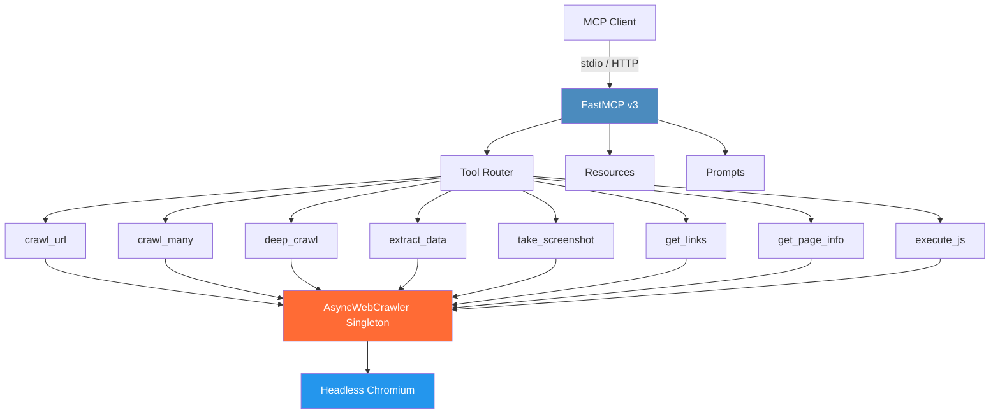

<div align="center">

# Crawl4AI-MCP


*A Model Context Protocol server for web crawling powered by Crawl4AI*

<!-- BADGES:START -->
<!-- generated by add-badges 2026-03-02 -->
[](https://github.com/wyattowalsh/crawl4ai-mcp/actions/workflows/ci.yml)
[](https://codecov.io/gh/wyattowalsh/crawl4ai-mcp)
[](https://pypi.org/project/mcp-crawl4ai/)

[](https://docs.astral.sh/ruff/)
[](https://pre-commit.com/)
[](https://github.com/wyattowalsh/crawl4ai-mcp/security/dependabot)

[](https://www.python.org/downloads/)
[](https://github.com/wyattowalsh/crawl4ai-mcp/blob/main/LICENSE)

[](https://modelcontextprotocol.ai)
[](https://github.com/jlowin/fastmcp)
[](https://github.com/unclecode/crawl4ai)
[](https://www.docker.com/)
[](https://wyattowalsh.github.io/crawl4ai-mcp/)

[](https://github.com/wyattowalsh/crawl4ai-mcp/stargazers)
[](https://github.com/wyattowalsh/crawl4ai-mcp/commits)
<!-- BADGES:END -->

</div>

---

## Overview

**Crawl4AI-MCP** is a [Model Context Protocol](https://modelcontextprotocol.io) server that gives AI systems access to the live web. Built on [FastMCP v3](https://github.com/jlowin/fastmcp) and [Crawl4AI](https://github.com/unclecode/crawl4ai), it exposes **8 tools**, **2 resources**, and **3 prompts** through the standardized MCP interface, backed by a lifespan-managed headless Chromium browser.

**Only 2 runtime dependencies** &mdash; `fastmcp` and `crawl4ai`.

> [!TIP]
> **[Full documentation site &rarr;](https://wyattowalsh.github.io/crawl4ai-mcp/)**

### Key Features

- **Full MCP compliance** via FastMCP v3 with tool annotations (`readOnlyHint`, `destructiveHint`, etc.)
- **8 focused tools** for crawling, extraction, screenshots, and more
- **3 prompts** for common LLM workflows (summarize, extract schema, compare pages)
- **2 resources** exposing server configuration and version info
- **Headless Chromium** managed as a lifespan singleton (start once, reuse everywhere)
- **Multiple transports** &mdash; stdio (default) and Streamable HTTP
- **LLM-optimized output** &mdash; markdown, cleaned HTML, raw HTML, or plain text
- **Structured data extraction** using CSS selector schemas
- **Breadth-first deep crawling** with configurable depth and page limits
- **Auto browser setup** &mdash; detects missing Playwright browsers and installs automatically

---

## Installation

<details>
<summary><strong>pip</strong></summary>

```bash
pip install crawl4ai-mcp
crawl4ai-mcp --setup       # one-time: installs Playwright browsers
```

</details>

<details>
<summary><strong>uv (recommended)</strong></summary>

```bash
uv add crawl4ai-mcp
crawl4ai-mcp --setup       # one-time: installs Playwright browsers
```

</details>

<details>
<summary><strong>Docker</strong></summary>

```bash
docker build -t crawl4ai-mcp .
docker run -p 8000:8000 crawl4ai-mcp
```

The Docker image includes Playwright browsers &mdash; no separate setup needed.

</details>

<details>
<summary><strong>Development</strong></summary>

```bash
git clone https://github.com/wyattowalsh/crawl4ai-mcp.git
cd crawl4ai-mcp
uv sync --group dev
crawl4ai-mcp --setup
```

</details>

> [!NOTE]
> The server auto-detects missing Playwright browsers on first startup and attempts to install them automatically. You can also run `crawl4ai-mcp --setup` or `crawl4ai-setup` manually at any time.

---

## Quick Start

<details open>
<summary><strong>stdio (default &mdash; for Claude Desktop, Cursor, etc.)</strong></summary>

```bash
crawl4ai-mcp
```

</details>

<details>
<summary><strong>HTTP transport</strong></summary>

```bash
crawl4ai-mcp --transport http --port 8000
```

</details>

<details>
<summary><strong>Claude Desktop configuration</strong></summary>

Add to your Claude Desktop MCP settings (`claude_desktop_config.json`):

```json
{
  "mcpServers": {
    "crawl4ai": {
      "command": "crawl4ai-mcp",
      "args": ["--transport", "stdio"]
    }
  }
}
```

</details>

<details>
<summary><strong>Claude Code configuration</strong></summary>

```bash
claude mcp add crawl4ai -- crawl4ai-mcp --transport stdio
```

</details>

<details>
<summary><strong>MCP Inspector</strong></summary>

```bash
npx @modelcontextprotocol/inspector crawl4ai-mcp
```

</details>

---

## Tools

### `crawl_url`

Crawl a single web page and extract its content.

<details>
<summary>Parameters</summary>

| Parameter | Type | Default | Description |
|-----------|------|---------|-------------|
| `url` | `str` | *required* | The URL to crawl. Must be http or https. |
| `output_format` | `"markdown"` \| `"html"` \| `"text"` \| `"cleaned_html"` | `"markdown"` | Output format for the extracted content. |
| `css_selector` | `str \| None` | `None` | CSS selector to extract a specific page section. |
| `word_count_threshold` | `int` (&ge;0) | `200` | Minimum word count threshold for content blocks. |
| `wait_for` | `str \| None` | `None` | CSS selector or JS expression to wait for before extraction. |
| `bypass_cache` | `bool` | `False` | Skip cached results and perform a fresh crawl. |

**Returns:** Page content as a string in the requested format (truncated at 25K chars).

</details>

---

### `crawl_many`

Crawl up to 20 URLs concurrently and return all results.

<details>
<summary>Parameters</summary>

| Parameter | Type | Default | Description |
|-----------|------|---------|-------------|
| `urls` | `list[str]` (1&ndash;20) | *required* | List of URLs to crawl concurrently. |
| `output_format` | `"markdown"` \| `"html"` \| `"text"` \| `"cleaned_html"` | `"markdown"` | Output format for extracted content. |
| `css_selector` | `str \| None` | `None` | CSS selector to extract a specific page section. |
| `word_count_threshold` | `int` (&ge;0) | `200` | Minimum word count threshold for content blocks. |
| `wait_for` | `str \| None` | `None` | CSS selector or JS expression to wait for before extraction. |
| `bypass_cache` | `bool` | `False` | Skip cached results and perform fresh crawls. |

**Returns:** JSON array of `{url, success, content}` objects (each item truncated at 5K chars).

</details>

---

### `deep_crawl`

Breadth-first recursive crawl starting from a seed URL.

<details>
<summary>Parameters</summary>

| Parameter | Type | Default | Description |
|-----------|------|---------|-------------|
| `url` | `str` | *required* | The seed URL to start deep crawling from. |
| `max_depth` | `int` (1&ndash;5) | `2` | Maximum crawl depth from the seed URL. |
| `max_pages` | `int` (1&ndash;100) | `10` | Maximum total pages to crawl. |
| `include_external` | `bool` | `False` | Follow links to external domains. |
| `output_format` | `"markdown"` \| `"html"` \| `"text"` \| `"cleaned_html"` | `"markdown"` | Output format for extracted content. |
| `css_selector` | `str \| None` | `None` | CSS selector to extract a specific page section. |
| `word_count_threshold` | `int` (&ge;0) | `200` | Minimum word count threshold for content blocks. |
| `bypass_cache` | `bool` | `False` | Skip cached results and perform fresh crawls. |

**Returns:** JSON object with `seed_url`, `pages_crawled`, and `results` array (per-page URL, depth, and content).

</details>

---

### `extract_data`

Extract structured data from a page using a CSS selector schema.

<details>
<summary>Parameters</summary>

| Parameter | Type | Default | Description |
|-----------|------|---------|-------------|
| `url` | `str` | *required* | The URL to extract structured data from. |
| `schema` | `dict` | *required* | CSS extraction schema with `name`, `baseSelector`, and `fields` array. Each field has `name`, `selector`, `type` (`"text"` or `"attribute"`), and optional `attribute`. |
| `wait_for` | `str \| None` | `None` | CSS selector or JS expression to wait for before extraction. |

**Returns:** Extracted data as a JSON array.

</details>

<details>
<summary>Example schema</summary>

```json
{
  "name": "products",
  "baseSelector": ".product-card",
  "fields": [
    { "name": "title", "selector": "h2", "type": "text" },
    { "name": "price", "selector": ".price", "type": "text" },
    { "name": "link", "selector": "a", "type": "attribute", "attribute": "href" }
  ]
}
```

</details>

---

### `take_screenshot`

Capture a full-page PNG screenshot of a web page.

<details>
<summary>Parameters</summary>

| Parameter | Type | Default | Description |
|-----------|------|---------|-------------|
| `url` | `str` | *required* | The URL to screenshot. |
| `wait_for` | `str \| None` | `None` | CSS selector or JS expression to wait for before capture. |
| `viewport_width` | `int` (320&ndash;3840) | `1280` | Viewport width in pixels. |
| `viewport_height` | `int` (240&ndash;2160) | `720` | Viewport height in pixels. |

**Returns:** JSON object with `url`, `screenshot_base64` (base64-encoded PNG), and `format`.

</details>

---

### `get_links`

Extract and categorize all links found on a web page.

<details>
<summary>Parameters</summary>

| Parameter | Type | Default | Description |
|-----------|------|---------|-------------|
| `url` | `str` | *required* | The URL to extract links from. |

**Returns:** JSON object with `internal_links`, `external_links`, and totals for each category.

</details>

---

### `get_page_info`

Get metadata and summary information about a web page.

<details>
<summary>Parameters</summary>

| Parameter | Type | Default | Description |
|-----------|------|---------|-------------|
| `url` | `str` | *required* | The URL to inspect. |

**Returns:** JSON object with `title`, `description`, `language`, `links_count`, `media_count`, and full `metadata` dict.

</details>

---

### `execute_js`

Execute JavaScript on a rendered page and return the resulting content.

<details>
<summary>Parameters</summary>

| Parameter | Type | Default | Description |
|-----------|------|---------|-------------|
| `url` | `str` | *required* | The URL to load before executing JavaScript. |
| `js_code` | `str` | *required* | JavaScript code to execute on the page after it loads. |
| `wait_for` | `str \| None` | `None` | CSS selector or JS expression to wait for after JS execution. |
| `output_format` | `"markdown"` \| `"html"` \| `"text"` \| `"cleaned_html"` | `"markdown"` | Output format for the resulting content. |

**Returns:** Page content after JS execution as a string in the requested format.

</details>

---

## Resources

| URI | MIME Type | Description |
|-----|-----------|-------------|
| `config://server` | `application/json` | Current server configuration: name, version, tool list, browser config |
| `crawl4ai://version` | `application/json` | Server and dependency version information (server, crawl4ai, fastmcp) |

## Prompts

| Prompt | Parameters | Description |
|--------|------------|-------------|
| `summarize_page` | `url`, `focus` (default: `"key points"`) | Crawl a page and summarize its content with the specified focus |
| `build_extraction_schema` | `url`, `data_type` | Inspect a page and build a CSS extraction schema for `extract_data` |
| `compare_pages` | `url1`, `url2` | Crawl two pages and produce a structured comparison |

---

## Architecture



The server uses a single-module architecture:

- **FastMCP v3** handles MCP protocol negotiation, transport, tool/resource/prompt registration, and message routing
- **Lifespan-managed `AsyncWebCrawler`** starts a headless Chromium browser once at server startup and shares it across all tool invocations, then shuts it down cleanly on exit
- **8 tool functions** decorated with `@mcp.tool()` call directly into the crawl4ai API
- **2 resource functions** decorated with `@mcp.resource()` return JSON
- **3 prompt functions** decorated with `@mcp.prompt` return structured `Message` lists

> [!IMPORTANT]
> There are no intermediate manager classes or custom HTTP clients. The server delegates all crawling to crawl4ai's `AsyncWebCrawler` and all protocol handling to FastMCP. Only **2 runtime dependencies**.

---

## Configuration

<details>
<summary><strong>CLI flags</strong></summary>

| Flag | Default | Description |
|------|---------|-------------|
| `--transport` | `stdio` | Transport protocol: `stdio` or `http` |
| `--host` | `0.0.0.0` | Host to bind (HTTP transport only) |
| `--port` | `8000` | Port to bind (HTTP transport only) |
| `--setup` | &mdash; | Install Playwright browsers and exit |

</details>

<details>
<summary><strong>Environment variables</strong></summary>

No environment variables are required. The server uses sensible defaults for all configuration. Crawl4AI's own environment variables (e.g., `CRAWL4AI_VERBOSE`) are respected if set.

</details>

---

## Testing

```bash
# Run all tests
uv run pytest

# With coverage
uv run pytest --cov=crawl4ai_mcp --cov-report=term-missing

# Smoke tests only
uv run pytest -m smoke

# Manual live test (requires browser)
uv run python tests/manual/test_live.py
```

> [!NOTE]
> All automated tests run in-memory using `fastmcp.Client(mcp)` &mdash; no browser or network required. The test suite mocks `AsyncWebCrawler` for fast, deterministic execution.

---

## Contributing

See the [Contributing Guide](.github/CONTRIBUTING.md) for details on setting up your development environment, coding standards, and the pull request process.

## License

This project is licensed under the MIT License. See the [LICENSE](LICENSE) file for details.

---

<div align="center">

**Crawl4AI-MCP** &mdash; *Connecting AI to the Live Web*

</div>
