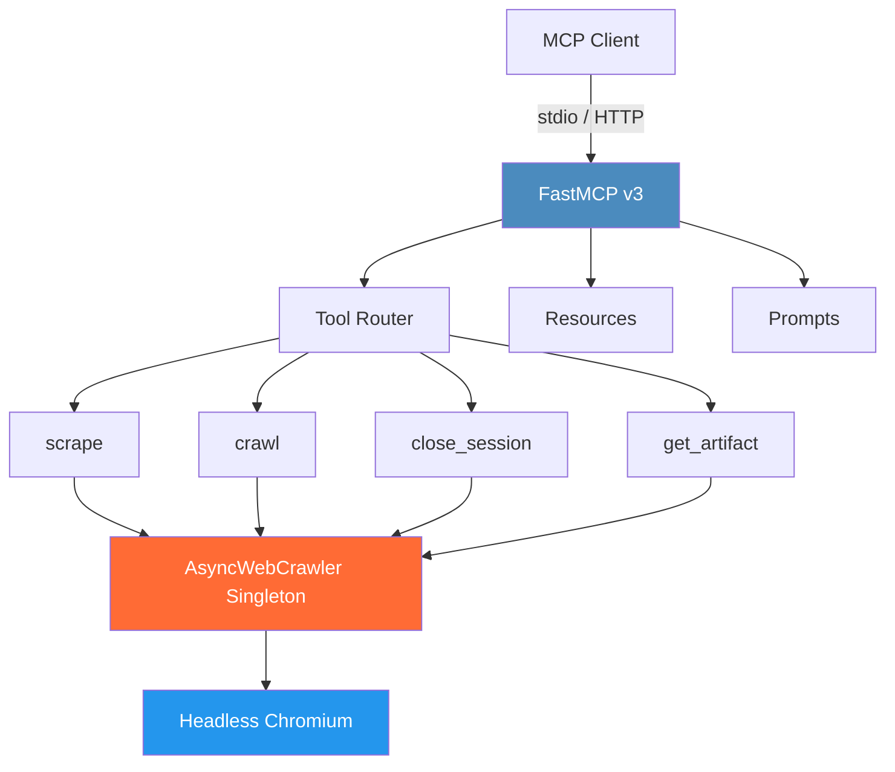

<div align="center">

# MCP-Crawl4AI


*A Model Context Protocol server for web crawling powered by Crawl4AI*

<!-- BADGES:START -->
<!-- generated by add-badges 2026-03-02 -->
[](https://github.com/wyattowalsh/mcp-crawl4ai/actions/workflows/ci.yml)
[](https://codecov.io/gh/wyattowalsh/mcp-crawl4ai)
[](https://pypi.org/project/mcp-crawl4ai/)

[](https://docs.astral.sh/ruff/)
[](https://pre-commit.com/)
[](https://github.com/wyattowalsh/mcp-crawl4ai/security/dependabot)

[](https://www.python.org/downloads/)
[](https://github.com/wyattowalsh/mcp-crawl4ai/blob/main/LICENSE)

[](https://modelcontextprotocol.ai)
[](https://github.com/jlowin/fastmcp)
[](https://github.com/unclecode/crawl4ai)
[](https://www.docker.com/)
[](https://wyattowalsh.github.io/mcp-crawl4ai/)

[](https://github.com/wyattowalsh/mcp-crawl4ai/stargazers)
[](https://github.com/wyattowalsh/mcp-crawl4ai/commits)
<!-- BADGES:END -->

</div>

---

## Overview

**MCP-Crawl4AI** is a [Model Context Protocol](https://modelcontextprotocol.io) server that gives AI systems access to the live web. Built on [FastMCP v3](https://github.com/jlowin/fastmcp) and [Crawl4AI](https://github.com/unclecode/crawl4ai), it exposes **4 tools**, **2 resources**, and **3 prompts** through the standardized MCP interface, backed by a lifespan-managed headless Chromium browser.

**Only 2 runtime dependencies** &mdash; `fastmcp` and `crawl4ai`.

> [!TIP]
> **[Full documentation site &rarr;](https://wyattowalsh.github.io/mcp-crawl4ai/)**

### Key Features

- **Full MCP compliance** via FastMCP v3 with tool annotations (`readOnlyHint`, `destructiveHint`, etc.)
- **4 focused tools** centered on canonical scrape/crawl plus session lifecycle/artifacts
- **3 prompts** for common LLM workflows (summarize, extract schema, compare pages)
- **2 resources** exposing server configuration and version info
- **Headless Chromium** managed as a lifespan singleton (start once, reuse everywhere)
- **Multiple transports** &mdash; stdio (default) and Streamable HTTP
- **LLM-optimized output** &mdash; markdown, cleaned HTML, raw HTML, or plain text
- **Canonical option groups** for extraction, runtime, diagnostics, sessions, rendering, and traversal
- **List and deep traversal** in one `crawl` contract
- **Session-aware workflows** with explicit session close and artifact retrieval tools
- **Auto browser setup** &mdash; detects missing Playwright browsers and installs automatically

---

## Installation

<details>
<summary><strong>pip</strong></summary>

```bash
pip install mcp-crawl4ai
mcp-crawl4ai --setup       # one-time: installs Playwright browsers
```

</details>

<details>
<summary><strong>uv (recommended)</strong></summary>

```bash
uv add mcp-crawl4ai
mcp-crawl4ai --setup       # one-time: installs Playwright browsers
```

</details>

<details>
<summary><strong>Docker</strong></summary>

```bash
docker build -t mcp-crawl4ai .
docker run -p 8000:8000 mcp-crawl4ai
```

The Docker image includes Playwright browsers &mdash; no separate setup needed.

</details>

<details>
<summary><strong>Development</strong></summary>

```bash
git clone https://github.com/wyattowalsh/mcp-crawl4ai.git
cd mcp-crawl4ai
uv sync --group dev
mcp-crawl4ai --setup
```

</details>

> [!NOTE]
> The server auto-detects missing Playwright browsers on first startup and attempts to install them automatically. You can also run `mcp-crawl4ai --setup` or `crawl4ai-setup` manually at any time.

---

## Quick Start

<details open>
<summary><strong>stdio (default &mdash; for Claude Desktop, Cursor, etc.)</strong></summary>

```bash
mcp-crawl4ai
```

</details>

<details>
<summary><strong>HTTP transport</strong></summary>

```bash
mcp-crawl4ai --transport http --port 8000
```

> [!NOTE]
> HTTP binds to `127.0.0.1` by default (private/local only); for external exposure, set `--host` explicitly and use a reverse proxy for TLS/auth.

</details>

<details>
<summary><strong>Claude Desktop configuration</strong></summary>

Add to your Claude Desktop MCP settings (`claude_desktop_config.json`):

```json
{
  "mcpServers": {
    "crawl4ai": {
      "command": "mcp-crawl4ai",
      "args": ["--transport", "stdio"]
    }
  }
}
```

</details>

<details>
<summary><strong>Claude Code configuration</strong></summary>

```bash
claude mcp add crawl4ai -- mcp-crawl4ai --transport stdio
```

</details>

<details>
<summary><strong>MCP Inspector</strong></summary>

```bash
npx @modelcontextprotocol/inspector uv --directory . run mcp-crawl4ai
```

</details>

---

## Tools

The canonical surface now exposes **4 tools**:

### `scrape`

Scrape one URL or a bounded list of URLs (up to 20) with a single canonical envelope response.

- Input: `targets` (`str | list[str]`) and optional grouped `options`
- Supports extraction (`schema`, `extraction_mode`), runtime controls, diagnostics, session settings, render settings, and artifact capture
- Returns canonical JSON envelope with `schema_version`, `tool`, `ok`, `data/items`, `meta`, `warnings`, `error`

### `crawl`

Crawl with canonical traversal controls.

- `options.traversal.mode="list"` for bounded list traversal
- `options.traversal.mode="deep"` for recursive BFS/DFS traversal from a single seed
- Shares scrape option groups plus traversal options in the same envelope shape

### `close_session`

Close a stateful session created via `options.session.session_id`.

### `get_artifact`

Retrieve artifact metadata/content captured during `scrape` or `crawl` when `options.conversion.capture_artifacts` is enabled.

### Choosing core vs advanced usage

- **Core path (recommended):** use `scrape`/`crawl` with minimal options (`runtime`, `conversion.output_format`, `traversal.mode="list"`). This keeps behavior predictable and low-risk for most agent workflows.
- **Advanced path (explicit opt-in):** use deep traversal, custom dispatcher controls, JS transforms, extraction schemas, and artifact capture only when required by task outcomes.
- **Safety budgets and gates:** inspect `config://server` for `settings.defaults`, `settings.limits`, `settings.policies`, and `settings.capabilities` to understand active constraints and feature gates before enabling advanced options.

---

## Resources

| URI | MIME Type | Description |
|-----|-----------|-------------|
| `config://server` | `application/json` | Current server configuration: name, version, tool list, browser config |
| `crawl4ai://version` | `application/json` | Server and dependency version information (server, crawl4ai, fastmcp) |

## Prompts

| Prompt | Parameters | Description |
|--------|------------|-------------|
| `summarize_page` | `url`, `focus` (default: `"key points"`) | Crawl a page and summarize its content with the specified focus |
| `build_extraction_schema` | `url`, `data_type` | Inspect a page and build a CSS extraction schema for `scrape` |
| `compare_pages` | `url1`, `url2` | Crawl two pages and produce a structured comparison |

---

## Architecture



The server uses a single-module architecture:

- **FastMCP v3** handles MCP protocol negotiation, transport, tool/resource/prompt registration, and message routing
- **Lifespan-managed `AsyncWebCrawler`** starts a headless Chromium browser once at server startup and shares it across all tool invocations, then shuts it down cleanly on exit
- **4 tool functions** decorated with `@mcp.tool()` define the canonical surface
- **2 resource functions** decorated with `@mcp.resource()` return JSON
- **3 prompt functions** decorated with `@mcp.prompt` return structured `Message` lists

> [!IMPORTANT]
> There are no intermediate manager classes or custom HTTP clients. The server delegates all crawling to crawl4ai's `AsyncWebCrawler` and all protocol handling to FastMCP. Only **2 runtime dependencies**.

---

## Configuration

<details>
<summary><strong>CLI flags</strong></summary>

| Flag | Default | Description |
|------|---------|-------------|
| `--transport` | `stdio` | Transport protocol: `stdio` or `http` |
| `--host` | `127.0.0.1` | Host to bind (HTTP transport only) |
| `--port` | `8000` | Port to bind (HTTP transport only) |
| `--setup` | &mdash; | Install Playwright browsers and exit |

</details>

<details>
<summary><strong>Environment variables</strong></summary>

No environment variables are required. The server uses sensible defaults for all configuration. Crawl4AI's own environment variables (e.g., `CRAWL4AI_VERBOSE`) are respected if set.

</details>

---

## Testing

```bash
# Run all tests
uv run pytest

# Coverage gate (>=90%)
uv run pytest --cov=mcp_crawl4ai --cov-report=term-missing

# Smoke tests only
uv run pytest -m smoke

# Unit tests only
uv run pytest -m unit

# Integration workflow tests
uv run pytest -m integration

# End-to-end workflow tests
uv run pytest -m e2e

# Manual live test (requires browser)
uv run python tests/manual/test_live.py
```

> [!NOTE]
> All automated tests run in-memory using `fastmcp.Client(mcp)` &mdash; no browser or network required. The test suite mocks `AsyncWebCrawler` for fast, deterministic execution.

---

## Contributing

See the [Contributing Guide](.github/CONTRIBUTING.md) for details on setting up your development environment, coding standards, and the pull request process.

## License

This project is licensed under the MIT License. See the [LICENSE](LICENSE) file for details.

---

<div align="center">

**MCP-Crawl4AI** &mdash; *Connecting AI to the Live Web*

</div>
